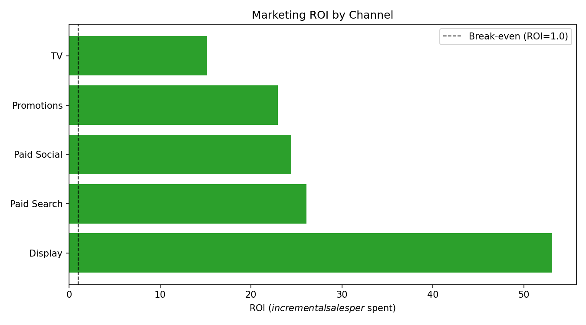
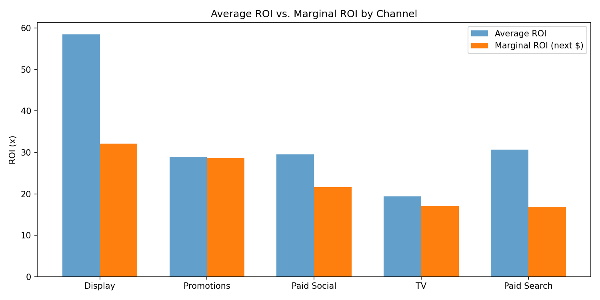
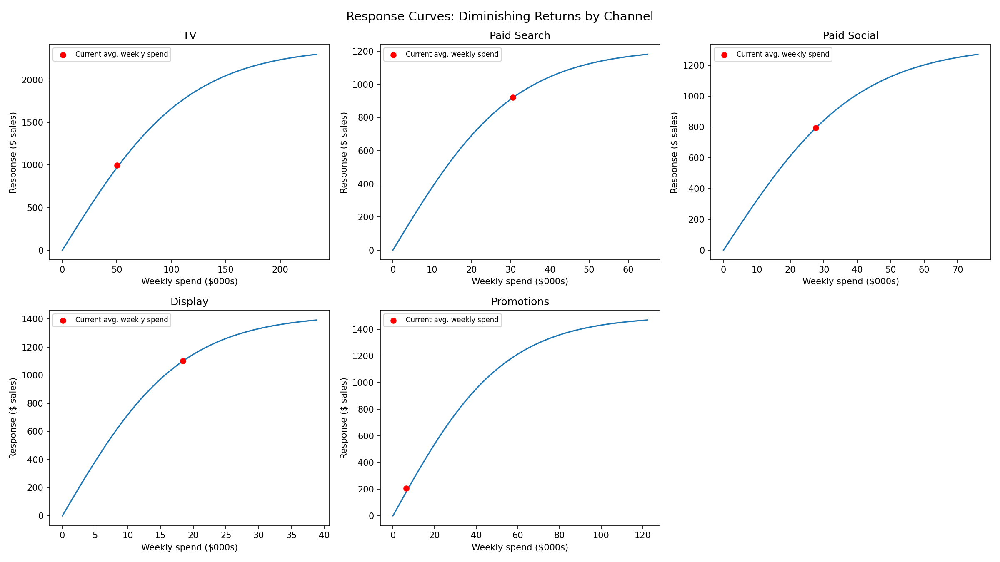
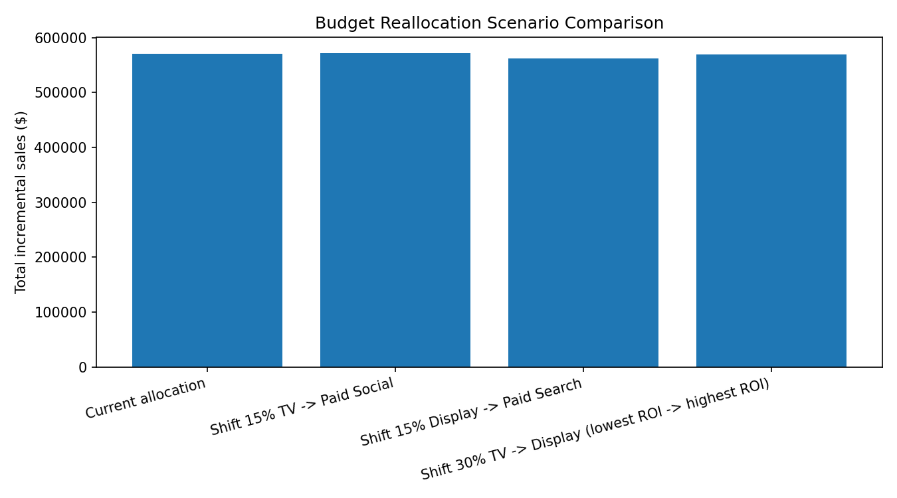
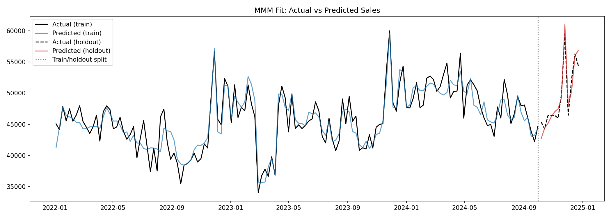

# Marketing Mix Model: Channel ROI & Budget Reallocation Recommendation

**Prepared by:** Jojo Bumba | **Period analyzed:** Jan 2022 - Sep 2024 (144 weeks) | **Model:** Bayesian MMM (PyMC-Marketing)

---

## Bottom line

Marketing drove **7.3% of total sales** ($483,929 of $6.60M) over the analysis period; the
remaining 92.7% is baseline demand (trend, seasonality, price, distribution). Within that
media budget, **TV is underfunded relative to its efficiency, and Display is nearing
saturation despite showing the highest average ROI on paper.** Reallocating **15% of the
TV budget to Display** is projected to increase incremental sales by **+1.16%** -- but this
is a peak, not a direction to keep pushing: reallocating further (30%+) reverses the gain
and actively destroys value.

## Channel performance

| Channel | Weekly spend | Total contribution | Average ROI | Marginal ROI |
|---|---|---|---|---|
| Display | $18.4K | $140,796 | 58.45x | 32.14x |
| Paid Search | $30.6K | $114,943 | 30.71x | 16.87x |
| Paid Social | $27.6K | $97,096 | 29.50x | 21.62x |
| Promotions | $6.4K | $21,041 | 28.93x | 28.65x |
| TV | $50.3K | $110,052 | 19.37x | 17.11x |

**Average ROI vs. marginal ROI diverge sharply for Display** (58x average vs. 32x
marginal) -- a signal that Display's headline number is inflated by its small budget base,
not by genuine headroom to scale. TV shows the smallest gap between average and marginal
ROI, meaning its efficiency is more stable across spend levels -- a more predictable channel
to invest incrementally.

*Note: Display's estimate carries wider uncertainty than other channels -- its weekly spend
varies very little, which makes its true effect harder for the model to isolate cleanly
from baseline trend. Directionally reliable, but treat with less confidence than TV or
Promotions.*

## Response curves: why "highest ROI" isn't "where to spend more"

Each channel has its own diminishing-returns curve. Display's curve flattens at a much
lower absolute spend level than TV's, which is exactly why chasing its high average ROI
with a large budget shift backfires.

## The reallocation recommendation

| Scenario | Incremental sales | vs. current |
|---|---|---|
| Current allocation | $570,784 | -- |
| Shift 5% TV -> Display | $578,856 | +0.75% |
| **Shift 15% TV -> Display** | **$581,230** | **+1.16%** |
| Shift 30% TV -> Display | $573,861 | -0.12% |
| Shift 50% TV -> Display | $552,990 | -3.75% |

The relationship is non-linear: incremental sales rise, peak around a 15% shift, then
fall as Display's diminishing-returns curve overtakes the value freed up from TV. This is
the core reason MMM outperforms simple attribution-based budgeting -- a channel's average
ROI alone doesn't tell you how much more spend it can efficiently absorb.

**Recommendation:** shift approximately 15% of TV budget into Display, monitor
performance for 4-6 weeks, then re-run marginal ROI analysis before making further
changes. Avoid reallocating in one large step -- the data shows real efficiency loss past
this point.

## Model validation

- **Out-of-sample holdout (12 weeks):** R^2 = 0.905-0.924, MAPE = 2.5%
- **Convergence:** all parameters r-hat <= 1.004 (well-converged)
- **Adstock:** geometric decay, up to 8 weeks of carryover per channel
- **Saturation:** logistic (Hill-type) diminishing-returns curve per channel, with
  business-informed priors (see technical note below)

---

## Technical note: why this model needed a tightened prior

During development, the model's default settings substantially overstated the impact of
low-spend-variation channels (Paid Search, Paid Social, and especially Display) -- Display's
estimated contribution was initially **22x higher than its known true value** in
validation testing against synthetic ground truth. The root cause: channels with little
week-to-week spend variation are statistically hard to distinguish from baseline trend,
and the model's default priors were wide enough to let it substitute one for the other.
Tightening the saturation prior (constraining plausible channel contribution to a more
realistic range) reduced this overstatement to ~4x while holdout accuracy stayed the same
or improved slightly (R^2 0.905 -> 0.924) -- meaning the fix cost nothing in predictive
performance while making the ROI decomposition far more credible.

This is a general MMM caveat, not specific to this dataset: **channels with limited spend
variation (e.g., "always-on" budgets that don't flight or burst) are inherently harder to
attribute accurately**, and any MMM should be read with that in mind.
